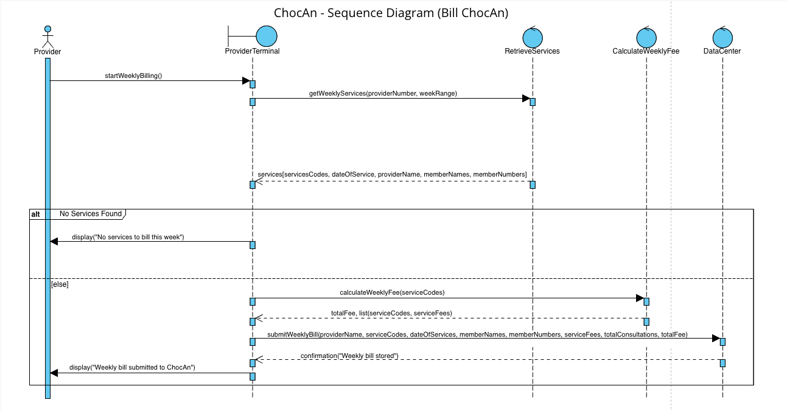

## Outline

1. Understand How the System Works  
    - Learn how ChocAn works with members, providers and the Data Center  
    - Identify what the system does such as checking IDs, recording services, creating reports and sending payments  
    - Break the work into smaller steps to see how data moves  
    - Make sure everything connects correctly between users and the system
2. Identify Actors and Use Cases  
    - List all people and systems that use ChocAn such as members, providers, managers, the Data Center and Acme Accounting Services  
    - Explain what each actor does  
    - Describe the 23 main use cases  
    - Make simple diagrams to show how actors and system functions connect
3. Find Nouns and Create Classes  
    - Find important nouns in the project description that show people, data or actions  
    - Turn these nouns into classes or attributes  
    - Group classes as Entity, Boundary or Control  
    - Make a table to show what each class does
4. Make CRC Cards and Responsibilities  
    - Make CRC cards to show what each class does and who it works with  
    - Keep each class focused on one main task  
    - Make sure every class connects to at least one use case
5. Show How Classes Interact  
    - Explain step by step how classes talk to each other during actions like recording a service  
    - Include normal and error cases such as invalid codes or suspended members  
    - Show how control moves from user input to system logic and stored data
6. Write Data Rules and Limits  
    - List all data rules like ID length, fee size and date format  
    - Write when special system tasks happen such as the Friday midnight batch  
    - Make a table that summarizes the data rules and limits
7. Plan the Test Workflow  
    - Write test cases for all 23 use cases  
    - Use both correct and incorrect inputs  
    - Write what the expected result should be  
    - Make a checklist to confirm reports, EFT files and updates work correctly
8. Finish and Review the Analysis  
    - Review all use cases, actors and classes  
    - Make sure all descriptions are clear and correct  
    - Check that all information fits together well  
    - Prepare tables, CRC cards and test results for submission

## Actors  

This section lists the main people and systems that take part in ChocAn’s operations. Each actor has a role in sending or receiving information such as providers, members, managers and the data center.

| *Actor* | *Description* |
| ----- | ----- |
| Member | A person who pays monthly fees and receives health services Each member has a nine digit ID card |
| Provider | A health worker such as a dietitian doctor or exercise expert who uses the terminal to record services and submit billing information |
| ChocAn Data Center | The main computer that manages all data for members and providers validates IDs records services creates reports and prepares payments |
| Manager (Accounts Payable) | Reviews provider reports and approves weekly payments |
| Acme Accounting Services | Handles membership fee payments and updates member records every night |
: The list of Actors.
  
## Use Cases  
This part describes what the system does for each actor. Each use case shows a main task like validating IDs, recording services, creating reports and running the weekly batch.

| *Use Case* | *Brief Description* |
| ----- | ----- |
| Verify Member Number (Provider) | The Verify Member Number use case enables providers to ensure that a person’s ChocAn membership is currently valid. |
| Verify Provider Number (Provider) | The Verify Provider Number use case allows providers to verify they are registered with the ChocAn system for proper accounting. |
| Request Provider Directory | The Request Provider Directory use case allows the provider to update and view all services and their service numbers and associated fees. |
| Lookup Service Code | The Lookup Service Code use case calls from the terminal to the ChocAn Data Center to retrieve an updated list of service codes and their accompanying descriptions. |
| Lookup Fee | The Lookup Fee use case takes a service code and looks up its associated fee. |
| Bill ChocAn | The Bill ChocAn use case runs weekly from the provider’s terminals to send a bill to the ChocAn database containing all the services, their codes, and associated fees, as well as the provider’s number. |
| Calculate Weekly Fee | The Calculate Weekly Fee use case takes the list of completed service codes on the provider’s terminal for the week and totals the fees for them. |
| Check Member Number (Server) | The Check Member Number use case takes a member number, queries the database and returns if it’s valid or invalid. |
| Check Provider Number (Server) | The Check Provider Number use case takes a provider number, queries the ChocAn database and returns valid or invalid. |
| Check Service Code | The Check Service Code use case queries the server for all currently available service codes and their associated descriptions, and returns them to the terminal. |
| Check Fee | The Check Fee use case takes a list of service codes and returns their associated fees. |
| Store Weekly Fees | The Store Weekly Fees use case takes a list of services and their associated fees and fee total from a provider for the week. |
| Weekly Report Generation | The Weekly Report Generation gathers all the provider’s fees from the past week that are currently in the DB and totals them up. |
| Weekly Accounting | The Weekly Accounting use case takes the weekly fees from the weekly report generation and sends them to Acme Accounting Services. |
| Print Financial Report | The Print Financial Report use case gets the weekly fees in the database for the week and prints them. |
| Add Provider | The Add Provider use case allows a ChocAn operator to add a provider to the ChocAn database. |
| Delete Provider | The Delete Provider use case allows a ChocAn operator to remove a provider from the ChocAn database. |
| Update Provider | The Update Provider use case allows a ChocAn operator to change details about a provider. |
| Add Member | The Add Member use case allows a ChocAn operator to add a new member to the ChocAn database. |
| Delete Member | The Delete Member use case allows a ChocAn operator to remove a member from the ChocAn database. |
| Update Member | The Update Member use case allows a ChocAn operator to edit details about a member in the ChocAn database. |
| Add Service Code | The Add Service Code use case allows a ChocAn operator to add a new service code to the service directory. |
| Update Service Code | The Update Service Code use case allows a ChocAn operator to update an existing service code in the service directory. |
| Delete Service Code | The Delete Service Code use case allows a ChocAn operator to delete an existing service code in the service directory. |
| Get Weekly Fees | The Get Weekly Fees use case gets the fees from the DB for the current or previous week. |
| Retrieve Services | The Retrieve Services use case fetches the services the provider has rendered in the past week. |
| Save Service | The Save Service use case allows a provider to store the services they render on their terminal, to be retrieved and uploaded to the ChocAn Data Center. |
: Summarized list of use cases and their descriptions.

## Noun Extraction  

This section lists important nouns found in the project description. These nouns help identify possible classes, objects, and data the system will use.

| Term | Becomes |
| ----- | ----- |
| Member or Member Number | Member |
| Provider or Provider Number | Provider |
| Service or Service Code | Service |
| Fee, Comment, or Date | Attributes of Service |
| Report or Summary | Report |
| Electronic Funds Transfer (EFT) | EFTRecord |
| Provider Directory | Directory |
| ChocAn Data Center | DataCenter |
| Manager | Manager |
| Acme Accounting Services | Accounting |
| Provider Terminal | ProviderTerminal |
: Table containing nouns extracted from the Use Cases.

## Entity Boundary and Control Classes

| Type | Class | Purpose |
| ----- | ----- | ----- |
| Entity | Member | Stores member details and status active or suspended |
| Entity | Provider | Stores provider details |
| Entity | Service | Stores service info date code fee and comments |
| Entity | Report | Holds data used for member provider and summary reports |
| Entity | EFTRecord | Holds payment info for each provider |
| Entity | Directory | Holds service names codes and fees |
| Entity | DataCenter | Verifies IDs stores records creates reports and prepares EFT files |
| Boundary | ProviderTerminal | Takes input from the provider and shows messages |
| Boundary | ManagerTerminal | Lets the manager view and review reports |
: List of classes broken down by Entity, Boundary, and Control.

## CRC Cards  

Lists the system’s main classes, what each one is responsible for and which other classes it works with. Helps define how data moves between different parts of the system.

| CLASS Member |
| :---- |
| RESPONSIBILITY |
| 1. Hold member number, name, address and status. |
| 2. Store active or suspended membership information. |
| 3. Link to all services received by this member. |
| 4. Provide data for weekly member reports. |
| 5. Update member information when changed. |
| 6. Retrieve member details when validating. |
| COLLABORATION |
: Example CRC Card

## Example Use Case Record Service Provided  

This section shows one use case in full detail. It explains step by step how the Record Service Provided process happens from logging in to saving a completed record.  

### Step-by-Step Description  

1. The provider turns on the terminal and enters their nine-digit provider number.  
2. The terminal sends the number to Validation Control to check it in the Data Center.  
3. The system shows “Validated” if the number is correct. If not, it shows “Invalid Number” and asks again.  
4. The provider slides the member card or types the member’s number.  
5. Validation Control checks the member record in the Data Center.  
6. If the member is active, the screen shows “Validated.” If the member is suspended, it shows “Member Suspended,” and the process stops.  
7. The provider types the date of service, service code, and any short comments.  
8. The terminal sends that information to Billing Control.  
9. Billing Control uses the Directory to find the service name and fee.  
10. The system shows the service name and fee so the provider can check and confirm.  
11. After the provider confirms, the system saves all the details in the Data Center.  
12. The Data Center stores the record with the date, time, provider number, member number, service code, fee, and comments.  
13. The terminal shows the message “Service Recorded Successfully.”  

## Weekly Processing  

1. At midnight on Friday the system starts automatic weekly processing  
2. The Data Center reads all service records from that week  
3. A Member Report is created for each member showing all services they received  
4. A Provider Report is made for each provider with all services done and total fees  
5. A Summary Report is created for the manager showing total providers consultations and overall payments  
6. An EFT File is created for each provider with payment details  
7. The manager reviews and approves all reports  

***All reports stay stored in files for review and testing.***

## Data Rules and Limits

| Field | Rule or Limit |
| ----- | ----- |
| Member or Provider Number | 9 digits |
| Service Code | 6 digits |
| Service Name | Up to 20 characters |
| Comment | Up to 100 characters |
| Fee | Up to $999.99 |
| Weekly Total | Up to $99,999.99 |
| Date Format | MM-DD-YYYY |
| Time Format | MM-DD-YYYY HH:MM:SS |
| Batch Run | Every Friday at 12 A.M. |
| Input and Output | Keyboard and screen |
| File Naming | Name+Date.doc |
: Data restrictions.

## Message Flow (Step-by-Step Version)  

This message flow shows how information moves through the system when a provider records a service for a member.

### Step-by-Step Message Flow

1. The Provider starts by entering their provider number into the ProviderTerminal.
2. The ProviderTerminal sends the provider number to the DataCenter.
3. The DataCenter checks if the provider number is valid.
4. If valid, the ProviderTerminal displays “Validated.”
5. The Provider then enters the member number.
6. The ProviderTerminal sends the member number to the DataCenter.
7. The DataCenter checks if the member number is active, invalid, or suspended.
8. The ProviderTerminal shows the result on screen.
9. If both IDs are valid, the Provider enters the date of service, service code, and any comments.
10. The ProviderTerminal looks up the service name and fee from the Directory.
11. The ProviderTerminal sends the service details to the DataCenter.
12. The DataCenter stores the record, including provider number, member number, service code, date, and comments.
13. The DataCenter sends confirmation back to the ProviderTerminal.
14. The ProviderTerminal shows “Service Recorded Successfully” to the Provider.

### Summary of Interaction Order

| From | To | Action |
| ----- | ----- | ----- |
| Provider | ProviderTerminal | Enter provider number, member number, and service details |
| ProviderTerminal | DataCenter | Send IDs and service information for checking and storage |
| DataCenter | ProviderTerminal | Return validation messages and store confirmation |
| ProviderTerminal | Directory | Look up service name and fee |
| ProviderTerminal | Provider | Display results and confirmation |
: Summary of Interaction order.
   
## Test Workflow  

This section checks if the ChocAn system works properly. Each test follows the main steps the system does, like logging in, recording services, updating members and making reports. The goal is to make sure everything runs smoothly and shows the right results.  

| CLASS ChocAn System Test Class |
| ----- |
| RESPONSIBILTY | 
| 1. Test Verify Provider Number by entering a valid and invalid provider ID. |
| 2. Test Verify Member Number using valid, invalid and suspended members. |
| 3. Test Record Service Provided to confirm the system saves correct details. |
| 4. Test Add Member, Update Member and Delete Member to confirm changes are saved in the Data Center. |
| 5. Test Add Provider, Update Provider, and Delete Provider for correct provider management. |
| 6. Test Generate Member Report, Generate Provider Report and Generate Summary Report to confirm reports match stored data. |
| 7. Test Generate EFT File to verify payment totals are correct. |
| 8. Test Generate Provider Directory to ensure all services and codes appear alphabetically. |
| 9. Test Run Weekly Batch to confirm reports and EFT files are created automatically. |
| 10. Test Review Reports to confirm the manager can view and approve them. |
| 11. Test Check Member Status to confirm active and suspended members display correctly. |
| 12. Test Suspend Member and Reinstate Member to verify membership status changes. |
| 13.Test Send EFT to Bank to confirm provider payments are created properly. |
| COLLABORATION | 
| 1. Provider Class |
| 2. Member Class |
| 3. Service Class |
| 4. DataCenter Class |
| 5. Directory Class |
| 6. EFTRecord Class |
| 7. Report Class |
| 8. Manager Class |
| 9. Accounting Class |
| 10. ProviderTerminal Class |
: System Test Classes

## Responsibility Table  

This section connects each system function to the class that handles it.

| Task | Who Does It |
| ----- | ----- |
| Verify Provider Number | ProviderTerminal, DataCenter |
| Verify Member Number | ProviderTerminal, DataCenter |
| Record Service Provided | ProviderTerminal, Service, DataCenter |
| Lookup Service Code | ProviderTerminal, Directory, DataCenter |
| Lookup Fee | ProviderTerminal, Directory |
| Generate Reports | DataCenter, Report, Manager |
| Create EFT File | DataCenter, EFTRecord, Accounting |
| Maintain Records | DataCenter, Member, Provider |
| Generate Directory | Directory, DataCenter |
| Run Weekly Batch | DataCenter, Accounting |
| Error Handling | ProviderTerminal, DataCenter |
: Responsibility Breakdown
   
## Test Checklist  

1. Test all use cases one by one  
2. Make sure each record is stored properly  
3. Check that all classes connect correctly  
4. Compare reports with saved data  
5. Confirm that data formats and limits are followed  
6. Try invalid IDs and suspended accounts  
7. Run the Friday batch and check all reports  
8. Verify that EFT totals match reports  
9. Check the provider directory order  
10. Confirm that no real payments or emails are sent during testing  

## Deliverables

- List all use cases with details  
- Tables for Entity Boundary and Control classes  
- CRC cards for all main classes  
- Sequence and message flow steps  
- Data dictionary and field rules  
- Test workflow and checklist  
- Responsibility table  
- Glossary and conclusion
   
## Glossary  
   
## Sequence Diagram  

   
## usdiagrams  

