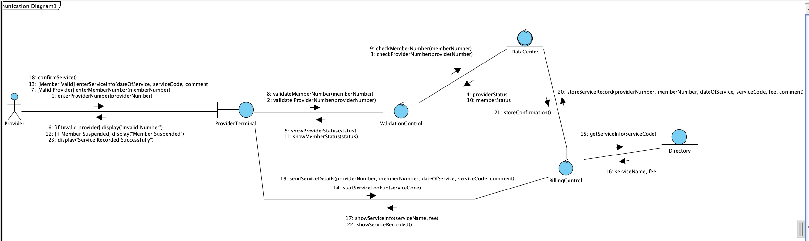

### Acknowledgement

Acknowledgement is given to Dr. Ayman Diyab for providing slides and required knowledge during lectures for the Term Project and to Mr. Mohammed AbuFoul for explanation and guides during laboratory session.

## Requirements

### Workflow Steps

The workflow was derived from *The Unified Process*[@Schach2010].

1. Develop an initial understanding of the target domain:
   * Research basic information about ChocoAn’s purpose, services, target market.
   * Build a glossary of terms based on information found during the initial research.
   * Refine the glossary as needed, like when the team encounters a new technical term.
2. Build Business Model:
   * Create UML diagrams to represent the client's process and system structure.
   * Include the use case diagrams to show interaction with the user and system.
   * Include the use case description diagrams to examine relationships between data.
3. Iterate the UML/Logic:
   * Review and improve diagrams through multiple iterations: Perform this by re-reading the Appendix entry and walking through our documentations.
   * Check whether the final model matches all client needs before final approval.
4. Define Requirements:
   * List what the system should do (functional) like validating members or generating reports.
   * List how the system should perform (non-functional) like response time, security and reliability.
5. Testing and validation:
   * Test the system/logic against the requirements.
   * Check if the model behaves correctly in different types of cases (valid and invalid inputs).

### Additional Considerations

#### Formatting

Inline code, meant to denote potential classes, methods, and attributes, is formatted through this document. `This is an example of inline code formatting used in this document.`

#### Tool Use

Gaphor[@GaphorDocs] was used for the creation of UML images. GitHub was utilized for collaboration and version tracking and management. Pandoc[@PandocManual] was used in the creation of the documentation thus far. Other tools used include Google Drive/Docs for collabaration, as well as Microsoft Office for formatting and docment generation. Visual Paradigm[@VisualParadigm] was used for the creation of some UML images.

#### Communication

The group has communicated primarliy through e-mail. Discord and in-person communication have also been utilized. Google drive was utilized initally for organizing documentation before a proper Git repository was created and access was distributed to each member.

### Glossary

| Term | Meaning |
| :---- | :---- |
| Accounts Payable | Amounts of money that ChocAn must pay to providers for services rendered to ChocAn members. |
| Acme Accounting Services | An independent, external organization (not affiliated with ChocAn) who conducts financial operations like suspending/reinstating members of ChocAn and handling payment records from these members. |
| Card Reader | A device that reads member card and send the data on the card to the system/terminal |
| ChocAn Data Center | The remote database responsible for tracking transactions, tracking and reporting member status. Central system where member, provider, and service records are stored and reports are processed. |
| Chocoholics Anonymous (ChocAn) | An organization established to assist people with chocolate addition in all its glorious forms. |
| Chocolate | Produced from roasted and ground cocoa beans, this energy-dense food exists in many forms and can be directly consumed or used to make other products/food. |
| Invalid (member number) | A member number that is reported as not found in the ChocAn Data Center database. |
| Electronic Funds Transfer | A method of electronically transferring funds between accounts (e... Chocoholics Anonymous banking account to provider’s banking account). |
| Member Card | A magnetic stripe card with member data like name and nine-digit member number engraved in the front and the same data stored in a black magnetic stripe in the back. |
| Member Status | The status of a member who registered with ChocAn. “Valid” means that the member has paid all their service fees, while “Suspended” indicates that the member still owes service fees. |
| Member | An individual who **pays a monthly fee to ChocAn** for which they are entitled to unlimited consultations and treatments with health care professionals. Possess a Member Card. |
| Monthly Fee | The amount paid every month to maintain membership with ChocAn. |
| Providers | A health care professional responsible for providing treatment to validated ChocAn members. Mainly dietitians, internists, and exercise experts. Receive payment from ChocAn. |
| Provider Directory | A catalog or list of all possible services, their codes, and fees; like a menu of treatments for members. |
| Services Rendered | Services provided by ChocAn providers to members that match a six-digit code listed in the Provider Directory. |
| Suspended (member state) | Suspended indicates that the fees haven't been paid in at least one month. Tracked by Acme Accounting Services. |
| Terminal | The hardware responsible for running the software. |
| Valid (member number) | A member number belonging to a ChocAn Member who is currently with their monthly fee. |
: A glossary of terms to better understand the ChocAn business model.

### Interview

The interview process was skipped as there was not practical way to interview the client (Appendix A). In lieu of an interview a rigorous examination of the appendix was conducted.

\newpage

### UML Use Case Diagram

{ height=74% }

\newpage

### **Defining Requirements** (Functional and Non-Functional)

#### Functional Requirements (what the system must do)

1. Check Member
    * The provider types in a 9 digit member number.
    * The system checks the number and shows one of these: Validated, Invalid number or Member suspended.
2. Record a Service
    * After the member is confirmed, the provider enters:
      *   Date the service was given (MM-DD-YYYY)
      *   Provider number (9 digits)
      *   Member number (9 digits)
      *   Service code (6 digits)
      *   Comment if needed (up to 100 letters)
    * The system saves this record with today’s date and time (MM-DD-YYYY HH:MM:SS)
3. Find a Service Code
    * The provider looks in the Provider Directory for the right six digit code.
    * The system shows the name of the service so the provider can check it.
    * If the code is wrong the system shows an error message.
4. Show the Fee
    * The system looks up the fee for the chosen service and shows it on the screen.
5. Weekly Provider Report
    * Every Friday at midnight, the system makes a report for each provider who gave services that week.
    * The report lists the provider’s name, number, address and all services done that week with the date, member name, member number, code, fee, total visits and total amount.
6. Weekly Member Report
    * Each member who had a service that week gets a report.
    * It lists the services in date order and shows the date, provider name and service name, plus the member’s name, number and address.
7. EFT File for Payment
    * The system makes a payment file that shows the provider name, number and total amount to be paid.
8. Summary Report
    * The system makes a summary for the accounts manager.
    * It lists every provider, how many visits they had, each provider’s total and the overall totals for the week.
9. Update Member and Provider Info
    * Staff at the Data Center can add, delete or update member records.
    * They can also add, delete or update provider records.
10. Provider Directory File
    * A provider can ask for a list of all services with their six digit codes and fees.
    * The system saves this list as a file.
 
#### Non-Functional Requirements (how the system should behave)

1. Time
    * The main accounting job runs every Friday at 12 am.
    * Reports can also be made any time if needed.
2. Data Rules and Formats
    * Member number – 9 digits
    * Provider number – 9 digits
    * Service code – 6 digits
    * Member name – 25 letters
    * Provider name – 25 letters
    * Comments – up to 100 letters
    * Fee per service – max $999.99
    * Total weekly fee – max $99 999.99
    * Use date format MM-DD-YYYY and time HH:MM:SS
3. Simulation and Limits
    * Other companies handle the terminals, EFT system and fee payments.
    * This system only uses the keyboard for input and shows results on the screen.
    * Reports and directories are saved as files not actually sent by email.
    * The ETF file only needs the provider name, provider number and amount to pay.

### Use-Case Descriptions

| Brief Description |
| :---- |
| The `Verify Member Number` use case enables providers to ensure that a person's ChocAn membership is currently valid. |
| **Step-by-Step Description** |
| Sends a query to the ChocAn data center containing a member number. Receives a response of either valid, member suspended, or invalid. Prints the response from the ChocAn data center. |
: The Verify Member Number use case description.

| Brief Description |
| :---- |
| The `Verify Provider Number` use case verifies providers are registered with the ChocAn system for proper accounting. |
| **Step-by-Step Description** |
| Runs once when the provider’s terminal is powered on. Sends a request to the ChocAn data center containing the provider’s number. Prints the return value of valid, or invalid. If invalid, re-prompts for the providerId. |
: The Verify Provider Number use case description.

| Brief Description |
| :---- |
| The `Request Provider Directory` use case allows the provider to update and view all services and their service numbers and associated fees. |
| **Step-by-Step Description** |
| Gets a list of serviceName and serviceCodes by calling the Lookup Service Code use case. Gets a list of associated fees by calling the Lookup Fee use case with a list of service Codes.  Sends an e-mail from the provider’s terminal to the provider containing a list of serviceNames, serviceCodes, and their associated serviceFees. |
: The Request Provider Directory use case description.

| Brief Description |
| :---- |
| The `Lookup Service Code` use case calls from the terminal to the ChocAn Data center to retrieve an updated list of service codes and their accompanying descriptions. |
| **Step-by-Step Description** |
| Take a request containing a service code or get a service list. Sends a request to the ChocAn data center requesting service code validation or the table containing serviceNames and serviceCodes. Returns either service valid or the list of serviceNames and serviceCodes. |
: The Lookup Service Code use case description.

| Brief Description |
| :---- |
| The `Lookup Fee` use case takes a service code and looks up its associated fee. |
| **Step-by-Step Description** |
| Receives a request containing a serviceCode or list of serviceCodes. Uses the Check Fee use case to retrieve the associated fees from the ChocAn database. Returns the serviceCode or serviceCodes and their serviceFees. |
: The Lookup Fee use case description.

| Brief Description |
| :---- |
| The `Bill ChocAn` use case runs weekly from the provider's terminals to send a bill to the ChocAn database containing all the services, their codes, and associated fees, as well as the provider's number. |
| **Step-by-Step Description** |
| Gets a list of serviceCodes, `dateOfService`, and `providerName` for the week by utilizing the Retrieve Services use case. Sends the list of serviceCodes retrieved in step 1 to the Calculate Weekly Fee use case. Receives a total fee and a list of serviceCodes and serviceFees from the Calculate Weekly Fee use case. Sends the `totalFee`, and list of serviceCodes, `dateOfService`s, `providerName`, `memberName`s, `memberNumber`s, and serviceFees, `totalConsultations`, to the ChocAn Data center. |
: The Bill ChocAn use case description.

| Brief Description |
| :---- |
| The `Calculate Weekly Fee` use case takes the list of completed service codes on the provider's terminal for the week and totals the fees for them.  |
| **Step-by-Step Description** |
| Receives a list of serviceCodes from the Bill ChocAn use case. Uses the Lookup Fee use case to get serviceFees for each serviceCode. Total the serviceFees from the Lookup Fee use case in step 2\. Returns the totalFee, serviceFees, and their associated serviceCodes. |
: The Calculate Weekly Fee use case description.

| Brief Description |
| :---- |
| The `Check Member Number` use case takes a member number, queries the database and returns if it's valid or invalid. |
| **Step-by-Step Description** |
| Receives a member number from the Verify Member Number use case. Queries the ChocAn database with the member number received from the Verify Member Number use case. Returns the current member status. |
: The Check Member Number use case description.

| Brief Description |
| :---- |
| The `Check Provider Number` use case takes a provider number, queries the database and returns valid or invalid. |
| **Step-by-Step Description** |
| Receives a member number from the Verify Provider Number use case. Queries the ChocAn database with the provider number. Returns either valid or invalid. |
: The Check Provider Number use case description.

| Brief Description |
| :---- |
| The `Check Service Code` use case queries the server for all currently available service codes and their associated descriptions, and returns them to the terminal. |
| **Step-by-Step Description** |
| Receives a list of service codes from the Lookup Service Code use case. Queries the ChocAn database with the code or list of service codes. Returns the serviceCodes and their associated serviceNames. |
: The Check Service Code use case description.

| Brief Description |
| :---- |
| The `Check Fee` use case takes a list of service codes and returns their associated fees. |
| **Step-by-Step Description** |
| Receives a list of serviceCodes from the Lookup Fee use case. Queries the ChocAn database with the serviceCodes received in step 1\. Returns the serviceCodes and their associated serviceFees. |
: The Check Fee use case description.

| Brief Description |
| :---- |
| The `Store Weekly Fees` use case takes a list of services and their associated fees and fee total from a provider for the week. |
| **Step-by-Step Description** |
| Receives a list of `serviceCode`s, `serviceFee`s, and a `totalFee` from the `Bill ChocAn` use case. Stores the list in the ChocAn database. |
: The Store Weekly Fees use case description.

| Brief Description |
| :---- |
| The `Weekly Report Generation` gathers all the provider's fees from the past week that are currently in the db and totals them up. |
| **Step-by-Step Description** |
| Receives a request from the `Weekly Accounting` use case with a range of dates. Sends a request to the `Get Weekly Fees` use case to retrieve all fees that were delivered in the range of dates provided in step 1\. Receives a response from the `Get Weekly Fees` use case containing a list of dates and total fees in that date range. Generates a report containing all of the weekly fees for the week, the total of weekly fees. Returns the total of weekly fees to the `Weekly Accounting` use case. |
: The Weekly Report Generation use case description.

| Brief Description |
| :---- |
| The `Weekly Accounting` use case takes the weekly fees from the weekly report generation and sends them to Acme Accounting Services. |
| **Step-by-Step Description** |
| Runs on a schedule every Friday at 12am. Sends a request to the `Weekly Report Generation` use case. Receives a total of weekly fees from the `Weekly Report Generation` use case. Sends the total of weekly fees to Acme Accounting. |
: The Weekly Accounting use case description.

| Brief Description |
| :---- |
| The `Print Financial Report` use case gets the weekly fees in the database for the week and prints them. |
| **Step-by-Step Description** |
| Sends a request containing the date range from last Friday at 12am to present to the `Get Weekly Fees` use case.  Receives a response from the `Get Weekly Fees` use case containing a list of all the weekly fees currently in the ChocAn database in the date range. Prints a Financial Report containing all the Weekly Fees and their associated provider numbers. |
: The Print Financial Report use case description.

| Brief Description |
| :---- |
| The `Add Provider` use case allows a ChocAn operator to add a provider to the ChocAn database. |
| **Step-by-Step Description** |
| Receives a provider number, and a provider name from a ChocAn operator. Adds the provider to the ChocAn database. |
: The Add Provider use case description.

| Brief Description |
| :---- |
| The `Delete Provider` use case allows a ChocAn operator to remove a provider from the ChocAn database. |
| **Step-by-Step Description** |
| Receives a provider number from a ChocAn operator. Removes the provider from the ChocAn database. |
: The Delte Provider use case description.

| Brief Description |
| :---- |
|  The  `Update Provider` use case allows a ChocAn operator to change details about a provider. |
| **Step-by-Step Description** |
| Receives a provider number and optionally a provider name, street address, city, state, zip to update for the given provider number. Updates the database entry for the provider number with the new information. |
: The Update Provider use case description.

| Brief Description |
| :---- |
| The `Add Member` use case allows a ChocAn operator to add a new member to the ChocAn database. |
| **Step-by-Step Description** |
| Receives a member number and member name from a ChocAn operator. Adds the member number and associated member name to the ChocAn database. |
: The Add Member use case description.

| Brief Description |
| :---- |
| The `Delete Member` use case allows a ChocAn operator to remove a member from the ChocAn database. |
| **Step-by-Step Description** |
| Receives a member number from a ChocAn operator. Removes the member associated with the member number from the ChocAn database. |
: The Delete Member use case description.

| Brief Description |
| :---- |
| The `Update Member` use case allows a ChocAn operator to edit details about a member in the ChocAn database. |
| **Step-by-Step Description** |
| Receives a member number and optionally a member name, member street address, member city, member state, member zip from a ChocAn operator. Updates the database entry for the given member number with any optionally included entries from step 1\. |
: The Update Member use case description.

| Brief Description |
| :---- |
| The `Get Weekly Fees` use case gets the fees from the DB for the current or previous week. |
| **Step-by-Step Description** |
| Receives a range of dates. Queries the ChocAn database for all `totalFee`s in the range of dates. Returns the list of `totalFees` for the given date range. |
: The Get Weekly Fees use case description.

| Brief Description |
| :---- |
| The `Retrieve Services` use case fetches the services the provider has rendered in the past week.  |
| **Step-by-Step Description** |
| Receives a request from the `Bill ChocAn` use case for a list of services. Queries the terminal for all `unsubmitted` services. Returns a list of all `unsubmitted` services, their associated `serviceId`s. Marks the services in the terminal as `submitted`. |
: The Retrieve Services use case description.

| Brief Description |
| :---- |
|  The `Save Service` use case allows a provider to store the services they render on their terminal, to be retrieved and uploaded to the ChocAn data center. |
| **Step-by-Step Description** |
| Receives a service from a provider containing `dateOfService`, `providerName` and `serviceName`. Stores the data in the terminal as `unsubmitted`. |
: The Save Service use case description.

## Analysis

### Outline

1. Understand How the System Works  
    - Learn how ChocAn works with members providers and the DataCenter  
    - Identify what the system does such as checking IDs recording services creating reports and sending payments  
    - Break the work into smaller steps to see how data moves  
    - Make sure everything connects correctly between users and the system

2. Identify Actors and Use Cases  
    - List all people and systems that interact with ChocAn such as members providers managers the DataCenter Acme Accounting Services and the ProviderTerminal  
    - Explain what each actor does  
    - Identify all main use cases and use Record Service Provided as the main example for the analysis  
    - Make simple diagrams to show how actors and system functions connect

3. Find Nouns and Create Classes  
    - Find important nouns in the project description and requirements that show people data or actions  
    - Turn these nouns into classes or attributes  
    - Group classes as Entity Boundary or Control  
    - Make a table to show what each class does including the ServiceRecord class used in Record Service Provided

4. Make CRC Cards and Responsibilities  
    - Make CRC cards to show what each class does and who it works with using Record Service Provided as the main example  
    - Keep each class focused on one main task  
    - Make sure every class connects to at least one use case

5. Show How Classes Interact  
    - Explain step by step how classes talk to each other during Record Service Provided  
    - Include normal and error cases such as invalid codes or suspended members  
    - Show how control moves from user input to system logic and stored data

6. Write Data Rules and Limits  
    - List all data rules such as ID length fee size and date format  
    - Write when special system tasks happen such as the Friday midnight batch  
    - Make a table that summarizes the data rules and limits

7. Plan the Test Workflow  
    - Write test cases for the Record Service Provided use case  
    - Use correct and incorrect inputs  
    - Write what the expected result should be  
    - Make a checklist to confirm reports EFT files and updates work correctly

8. Finish and Review the Analysis  
    - Review all use cases actors and classes  
    - Make sure all descriptions are clear and correct  
    - Check that all information fits together well  
    - Prepare tables CRC cards and test results for submission

### Actors  

This section lists the main people and systems that take part in ChocAn operations. Each actor sends or receives information during validation service entry reporting and weekly accounting.

| Actor | Description |
|-------|-------------|
| Member | A person who pays monthly fees and receives health services. Each member has a nine digit ID card and a status that may be valid suspended or invalid |
| Provider | A health worker such as a dietitian doctor or exercise expert who uses the terminal to record services and submit billing information |
| ProviderTerminal | The interface used by providers to validate IDs enter service information and communicate with the DataCenter |
| DataCenter | The main computer that manages all data for members and providers validates IDs records services creates reports and prepares weekly accounting files |
| ChocAn Operator | A system operator who adds updates or deletes member provider and service information in the DataCenter |
| Manager Accounts Payable | Reviews the weekly reports created by the system and receives a summary of all consultations and provider totals |
| Acme Accounting Services | Handles membership fee payments and updates member status every night |
: Table of Actors

### Noun Extraction

#### Use Case List

| Use Case | Brief Description |
|----------|------------------|
| Verify Member Number | Allows a provider to check if a member number is valid or suspended |
| Verify Provider Number | Allows a provider to confirm that their provider number is registered in the ChocAn system |
| Request Provider Directory | Allows the provider to view the list of services service codes and fees |
| Lookup Service Code | Retrieves the service name for a given service code |
| Lookup Fee | Retrieves the fee for a given service code |
| Record Service Provided | Allows a provider to enter a completed service including date service code and comments then store it in the DataCenter |
| Retrieve Services | Gets all services a provider completed within the week |
| Weekly Report Generation | Produces weekly reports for members providers and the manager |
| Weekly Accounting | Sends weekly fee totals and provider payments amounts to Acme Accounting Services |
| Print Financial Report | Prints the weekly financial summary |
| Add Provider | Allows the ChocAn operator to add a provider |
| Delete Provider | Allows the ChocAn operator to remove a provider |
| Update Provider | Allows the ChocAn operator to update provider information |
| Add Member | Allows the ChocAn operator to add a member |
| Delete Member | Allows the ChocAn operator to remove a member |
| Update Member | Allows the ChocAn operator to update member information |
| Add Service Code | Allows the ChocAn operator to add a new service code |
| Update Service Code | Allows the ChocAn operator to update a service code |
| Delete Service Code | Allows the ChocAn operator to delete a service code |
| Get Weekly Fees | Retrieves total fees for the current or previous week |
: Use cases and their brief descriptions.

#### Use Case Noun List

*Contains nouns extracted from use cases.*

| Use Case | Nouns |
|---|---|
| Verify Member Number (Provider) | Providers, Person, ChocAn, membership. |
| Verify Provider Number (Provider) | Providers, ChocAn system, accounting. |
| Request Provider Directory | Providers, services, service number, fees. |
| Lookup Service Code | Terminal, ChocAn DataCenter, list, service codes, descriptions. |
| Lookup Fee | Service Code, service fee. |
| Bill ChocAn | Provider's Terminals, bill, ChocAn database, services, codes, fees, provider number. |
| Calculate Weekly Fee | List, Service Codes, Terminal, Week, Fees. |
| Check Member Number (Server) | Member Number, Database. |
| Check Provider Number (Server) | Provider Number, ChocAn Database. |
| Check Service Code | Server, Service Code, Descriptions, Terminal. |
| Check Fee | List, Service Code, Fees. |
| Store Weekly Fees | List, Services, Fees, Fee Total, Provider, Week. |
| Weekly Report Generation | Provider, Fees, Week, Database. |
| Weekly Accounting | Fees, Report Generation, Acme Accounting Services. |
| Print Financial Report | Fees, Database, Week. |
| Add Provider | ChocAn Operator, provider, ChocAn database. |
| Delete Provider | ChocAn Operator, Provider, ChocAn database. |
| Update Provider | ChocAn Operator, Provider, Details, ChocAn database. |
| Add Member | ChocAn Operator, Member, ChocAn database. |
| Delete Member | ChocAn Operator, Member, ChocAn database. |
| Update Member | ChocAn Operator, Details, Member, ChocAn database. |
| Add Service Code | ChocAn Operator, Service Code, Service Directory. |
| Update Service Code | ChocAn Operator, Service Code, Service Directory. |
| Delete Service Code | ChocAn Operator, Service Code, Service Directory. |
| Get Weekly Fees | Fees, Database, Week. |
| Retrieve Services | Services, Provider, Week. |
| Save Service | Provider, Services, Terminal, ChocAn DataCenter. |
:Table containing nouns extracted from use cases.

#### Noun List

*A list of nouns extracted from the use cases*.

- [x] Providers
- [x] Person
- [x] ChocAn
- [x] Membership
- [x] ChocAn System
- [x] Accounting
- [x] Services
- [x] Service Number
- [x] Fees
- [x] Terminal
- [X] ChocAn DataCenter
- [ ] List
- [x] Service Codes
- [ ] Descriptions
- [x] Service Fee
- [x] Provider's Terminals
- [x] Bill
- [x] ChocAn Database
- [x] Codes
- [x] Provider Number
- [ ] Week
- [x] Member Number
- [x] Database
- [x] Server
- [x] Fee Total
- [x] Report Generation
- [x] Acme Accounting Services
- [x] ChocAn Operator
- [ ] Details
- [x] Member
- [x] Service Directory

#### Noun Grouping

*A section grouping the nouns extracted from the use cases.*

##### Member

- Person/Member
- Member Number
- Membership

##### Provider 

- Provider
- Provider Number
- Terminal/Provider's Terminal

##### Provider Services

- Services
- Codes/Service Codes
- Service Directory
- Service Number
- Service Fees

##### Service Fees

- Fees/Service Fees
- Fee Total

##### Billing

- Accounting
- Report Generation
- Bill
- Acme Accounting Services

##### ChocAn Database

- ChocAn/Server/Database/ChocAn Database/ChocAn System/ChocAn DataCenter

##### ChocAn Employees

- ChocAn Manager
- ChocAn Operator

#### Candidate Class List

- Member
- Provider
- Services/Provider Services
- Service Fees
- Billing
- ChocAn Database
- ChocAn Employees

\newpage

### Class Diagram

{ height=74% }

\newpage

### Entity, Boundary and Control Classes 

| Type | Class | Purpose |
|------|--------|---------|
| Entity | Member | Stores member information and membership status |
| Entity | Provider | Stores provider information and provider number |
| Entity | Service | Represents a service offered by ChocAn including service name, service code and fee used during service lookup|
| Entity | ServiceRecord | Stores one completed service with provider number member number date of service service code fee and comment |
| Entity | Directory | Holds all service names service codes and fees used during Record Service Provided |
| Entity | Report | Holds weekly report information for members providers and the manager |
| Entity | EFTFile | Holds weekly payment information for each provider |
| Boundary | ProviderTerminal | Receives provider input validates IDs and displays service information |
| Control | ValidationControl | Handles provider and member number validation through the DataCenter |
| Control | BillingControl | Handles service lookup confirmation building of ServiceRecord and submission |
| Control | DataCenter | Stores ServiceRecord entries performs validation supports reporting and runs weekly accounting |
: Table of Classes

### CRC Cards  

Lists the system main classes what each one is responsible for and which other classes it works with. This helps define how data moves between different parts of the system during Record Service Provided.

| CLASS ProviderTerminal (Boundary) |
| :---- |
| RESPONSIBILITY |
| 1. Receive provider number member number date of service service code and comment |
| 2. Display validation messages such as "Validated", "Invalid Number" and "Member Suspended" |
| 3. Request service name and fee from Directory through BillingControl |
| 4. Send completed service information to BillingControl |
| 5. Display final confirmation after the ServiceRecord is stored |
| COLLABORATION |
| 1. ValidationControl |
| 2. BillingControl |
: ProviderTerminal CRC Card

| CLASS ValidationControl (Control) |
| :---- |
| RESPONSIBILITY |
| 1. Validate provider numbers through DataCenter |
| 2. Validate member numbers and membership status |
| 3. Return validation results to ProviderTerminal |
| COLLABORATION |
| 1. DataCenter |
| 2. ProviderTerminal |
: ValidationControl CRC Card

| CLASS BillingControl (Control) |
| :---- |
| RESPONSIBILITY |
| 1. Receive record service request from ProviderTerminal after validation |
| 2. Request service name and fee from Directory using the service code |
| 3. Build a ServiceRecord with provider number member number date service code fee and comment |
| 4. Send the ServiceRecord to DataCenter for storage |
| 5. Return success or failure to ProviderTerminal |
| COLLABORATION |
| 1. ProviderTerminal |
| 2. Directory |
| 3. DataCenter |
| 4. ServiceRecord |
: BillingControl CRC Card

| CLASS DataCenter (Control) |
| :---- |
| RESPONSIBILITY |
| 1. Store ServiceRecord entries with timestamps |
| 2. Validate provider and member numbers |
| 3. Retrieve service information for reporting and accounting |
| 4. Support weekly processing and report generation |
| COLLABORATION |
| 1. ProviderTerminal |
| 2. ValidationControl |
| 3. BillingControl |
| 4. Directory |
| 5. Member |
| 6. Provider |
| 7.ServiceRecord |
: DataCenter CRC Card

| CLASS ServiceRecord (Entity) |
| :---- |
| RESPONSIBILITY |
| 1. Hold all fields for one recorded service provider number member number date of service service code fee comment and timestamp |
| 2. Provide data for weekly reporting and accounting |
| COLLABORATION |
| 1. BillingControl |
| 2. DataCenter |
: ServiceRecord CRC Card

### Example Use Case Record Service Provided  

This section shows one use case in full detail. It explains step by step how the Record Service Provided process happens from logging in to saving a completed record.

#### Step by Step Description

1. Provider enters provider number into the ProviderTerminal
2. ProviderTerminal sends the provider number to ValidationControl
3. ValidationControl checks the DataCenter and returns "Validated" or "Invalid Number"
4. Provider enters member number into the ProviderTerminal
5. ValidationControl checks the DataCenter for member status
6. If the member is suspended the ProviderTerminal shows Member Suspended and stops
7. Provider enters the date of service the service code and a comment
8. BillingControl requests the service name and fee from the Directory
9. Directory returns the service name and fee
10. ProviderTerminal displays the service name and fee for confirmation
11. Provider confirms the service information
12. ProviderTerminal sends the service details to BillingControl
13. BillingControl builds a ServiceRecord using the provider number member number date service code fee and comment
14. BillingControl sends the completed ServiceRecord to the DataCenter
15. DataCenter stores the ServiceRecord with a timestamp
16. ProviderTerminal displays Service Recorded Successfully

### Weekly Processing  

1. At midnight on Friday the system starts automatic weekly processing  
2. The DataCenter reads all ServiceRecords from that week  
3. A Member Report is created for each member showing all services they received  
4. A Provider Report is created for each provider with the list of services performed and the total fees  
5. A Summary Report is created showing the total number of providers total consultations and the total amount paid  
6. An EFT File is created for each provider containing the amount to be paid for the week  
7. The reports and EFT files are stored so they can be reviewed by the manager  

***All reports stay stored in files for review and testing.***

### Data Rules and Limits

| Field | Rule or Limit |
| ----- | ----- |
| Member Number | 9 digits |
| Provider Number | 9 digits |
| Service Code | 6 digits |
| Service Name | Up to 20 characters |
| Comment | Up to 100 characters |
| Fee | Up to $999.99 |
| Weekly Total | Up to $99,999.99 |
| Date Format | MM/DD/YYYY |
| Timestamp Format | MM/DD/YYYY HH:MM:SS |
| Weekly Batch Run | Every Friday at 12 AM |
| Input and Output | Keyboard input and screen output only |
| File Output | One file per Member Report Provider Report Summary Report and EFT File |
: Data restrictions.

### Message Flow (Step by Step Version)

This message flow shows how information moves through the system when a provider records a service for a member, using the Record Service Provided use case.

#### Step by Step Message Flow

1. The Provider enters their provider number into the ProviderTerminal
2. The ProviderTerminal sends the provider number to ValidationControl
3. ValidationControl asks the DataCenter to verify the provider number
4. The DataCenter returns the validation result to ValidationControl
5. The ProviderTerminal displays “Validated” or “Invalid Number”
6. The Provider enters the member number
7. The ProviderTerminal sends the member number to ValidationControl
8. ValidationControl checks the member status through the DataCenter
9. The ProviderTerminal displays “Validated”, “Invalid Number” or “Member Suspended”
10. If both numbers are valid the Provider enters the date of service service code and a comment
11. The ProviderTerminal sends the service code to BillingControl  
12. BillingControl requests the service name and fee from the Directory  
13. The Directory returns the service name and fee to BillingControl  
14. BillingControl sends the service name and fee to the ProviderTerminal for confirmation  
15. After the Provider confirms the ProviderTerminal sends all service details to BillingControl  
16. BillingControl builds a ServiceRecord using the provider number member number date service code fee and comment  
17. BillingControl sends the completed ServiceRecord to the DataCenter  
18. The DataCenter stores the ServiceRecord with a timestamp  
19. The DataCenter sends a confirmation to the ProviderTerminal  
20. The ProviderTerminal displays Service Recorded Successfully

#### Summary of Interaction Order

| From | To | Action |
|------|----|--------|
| Provider | ProviderTerminal | Enter provider number, member number and service details |
| ProviderTerminal | ValidationControl | Send ID validation requests |
| ValidationControl | DataCenter | Validate provider and member numbers |
| ProviderTerminal | BillingControl | Send service code and service details |
| BillingControl | Directory | Request service name and fee |
| BillingControl | DataCenter | Submit completed ServiceRecord |
| DataCenter | ProviderTerminal | Return validation and confirmation messages |
| ProviderTerminal | Provider | Display results and confirmation |
: Record Service Provided Interaction Order
   
### Test Workflow  

This section checks if the ChocAn system works properly. Each test follows the main steps of the **Record Service Provided** use case. The goal is to confirm that validation, service lookup and record storage all work correctly.

| CLASS ChocAn System Test Class |
| ----- |
| RESPONSIBILITY | 
| 1. Test Verify Provider Number using a valid and invalid provider numbers |
| 2. Test Verify Member Number using a valid, invalid and suspended member numbers |
| 3. Test Lookup Service Code to confirm the correct service name and fee appear |
| 4. Test Record Service Provided to ensure BillingControl builds a ServiceRecord correctly and the DataCenter stores it |
| 5. Test that the ProviderTerminal displays Service Recorded Successfully after storage |
| COLLABORATION | 
| 1. ProviderTerminal |
| 2. ValidationControl |
| 3. BillingControl |
| 4. DataCenter |
| 5. Directory |
| 6. ServiceRecord |
: System Test Classes

#### Test Workflow (Sample Test Cases)

| Test ID | Use Case | Test Condition | Expected Result | Class Responsibility Checked |
| :--- | :--- | :--- | :--- | :--- |
| AB-BC-001 | Record Service Provided | Member status is suspended, valid provider, correct date and service code | ProviderTerminal displays **Member Suspended** and stops the transaction. No ServiceRecord is created. | Confirms ValidationControl correctly interprets Member status |
| AB-BC-002 | Record Service Provided | Valid provider and member, non existent 6 digit service code (example 000000) | ProviderTerminal displays **Invalid Service Code** | Confirms BillingControl handles invalid service code lookup |
| AB-BC-003 | Weekly Processing | Friday midnight batch run | DataCenter creates Member Reports, Provider Reports, the Summary Report, and the EFTFile | Confirms DataCenter reporting and weekly output generation |
: Test Workflow Example

### Responsibility Table  

This section connects each system function to the class that handles it.

| Task | Who Does It |
| ----- | ----- |
| Verify Provider Number | ProviderTerminal ValidationControl DataCenter |
| Verify Member Number | ProviderTerminal ValidationControl DataCenter |
| Record Service Provided | ProviderTerminal ValidationControl BillingControl DataCenter |
| Lookup Service Code | ProviderTerminal BillingControl Directory |
| Lookup Fee | ProviderTerminal BillingControl Directory |
| Generate Reports | DataCenter Report |
| Create EFT File | DataCenter EFTFile |
| Maintain Member and Provider Records | DataCenter Member Provider |
| Manage Directory | Directory DataCenter |
| Run Weekly Batch | DataCenter Report EFTFile |
| Error Handling for IDs and Service Codes | ProviderTerminal ValidationControl BillingControl DataCenter |
: Responsibility Breakdown

### Test Checklist

1. Validate provider numbers using valid and invalid inputs
2. Validate member numbers using active, suspended and invalid numbers
3. Test service code lookup through BillingControl and confirm the correct service name and fee appear from the Directory  
4. Enter service details and confirm that BillingControl creates a ServiceRecord and the DataCenter stores it correctly  
5. Verify all system messages (“Validated”, “Invalid Number” “Member Suspended”)
6. Test invalid inputs (bad IDs, wrong date format and non existent service codes)
7. Run the Friday weekly batch and confirm member, provider and summary reports are generated
8. Check that each provider’s EFTFile total matches their total fees for the week
9. Confirm no emails or real payments are sent (file output only)

### Deliverables

- Summary of actors and use cases  
- Noun extraction and initial class identification including ServiceRecord
- Entity Boundary Control (EBC) class tables  
- CRC cards for the main classes  
- One fully detailed use case (Record Service Provided)  
- Message flow for the chosen use case  
- Sequence diagram for the chosen use case  
- Weekly processing summary  
- Data rules and limits table  
- Responsibility table  
- Test workflow and test checklist  
- Glossary of system terms

\newpage

### Sequence Diagram  

\newpage

### Communication Diagram  

\newpage

### Pseudo Code (Record Service Provided) Algorithm

1.  Ask ValidationControl to validate the provider number

2.  If provider number is invalid:
        Display "Invalid Number"
        STOP

3.  Ask ValidationControl to validate the member number and get the member status

4.  If member status is "Suspended":
        Display "Member Suspended"
        STOP

5.  If member status is "Invalid":
        Display "Invalid Number"
        STOP

6.  Ask BillingControl to look up the service name and fee from the Directory
    using the service code

7.  If the service code does not exist:
        Display "Invalid Service Code"
        STOP

8.  Display the service name and fee to the provider and request confirmation

9.  If the provider does not confirm:
        Display "Cancelled"
        STOP

10. Ask BillingControl to store a new ServiceRecord in the DataCenter
    The record must include:
        - provider number
        - member number
        - date of service
        - service code
        - fee
        - comment

11. If the DataCenter confirms that the record was stored successfully:
        Display "Service Recorded Successfully"
    Else:
        Display "Error while storing service"

END Algorithm

## Design

### Candidate Class Expansion

#### ProviderTerminal

##### Terminal

- Attributes:
    - Provider
    - reportRan: bool
- Methods:
    - Provider init(providerID)
    - verifyProviderID(providerID)
    - verifyMemberID(memberID)
    - recordTransaction(serviceID, memberID, time)
    - updateServiceList()
    - emailServiceList()
    - emailReceipt()
    - checkProviderTimer()

##### Member

- Attributes:
    public:
    - memberID: int
    private
    - memberName: string
    - memberAddress: string
    - memberPhone: string
    - memberEMail: string

##### Provider

- Attributes:
    public
    - providerID: int
    private
    - providerName: string
    - providerAddress: string
    - providerPhone: string
    - providerEMail: string

##### ServiceInstance

- Attributes:
    - rendered: Service
    - customer: Member
    - provider: Provider
    - time: arr(Date, Time)
- Methods:
    - save()            // Saves an instance of a service locally

##### ServiceList

- Attributes:
    - List: dict{id: Service}
- Methods:
    - refresh()         // Re-pulls from the database.

##### Service

- Attributes:
    - ID: int
    - Fee: float(2)
    - Name: string
    - Desc: string

##### ProviderReport

- Attributes:
    - weeklyServices: arr[serviceInstance]
- Methods:
    - sum(date, date) // Gets all service instances in a range and totals
                        // the fee.

#### ChocAn Mainframe

##### EmployeeTerminal

- Attributes:
    - employee: ChocAnEmployee
    - dbInstance: ChocAnDB
- Methods:
    - ChocAnEmployee, ChocAnDB init(EmployeeID)
    - registerMember()
    - editMemberInfo()
    - viewMemberInfo()
    - suspendMember()
    - hireEmployee()
    - updateEmployeeInfo()
    - viewEmployeeInfo()
    - fireEmployee()
    - registerProvider()
    - editProviderInfo()
    - viewProviderInfo()
    - suspendProvider()
    - registerService()
    - editServiceInfo()
    - viewServiceInfo()
    - suspendService()
    - initiateManagerReport()

##### MainScheduler

- Attributes:
    - timerRan: bool
- Methods
    - checkAcmeTimer()

##### ReportGenerator

- Attributes:
    - services: arr[ServiceInstance]
    - date: date
- Methods
    - generateReport(ChocAnEmployee, date1, date2, providerID(optional))        // Called by ChocAn managers over a date range. Can specify a provider.
    - generateWeeklyReport()                                                    // Automatically called weekly for the billing class.

##### Billing

- Attributes:
    - payouts: dict{providerID: FeeTotal}
    - period: date
- Methods:
    - weeklyBill(date)       // Gets the total fee for each provider for the previous week from the ReportGenerator and sends it to ACMEAccounting.

##### ChocAnDB

- Methods:
    - addEmployee()
    - removeEmployee(employeeID)
    - updateEmployee(employeeID)
    - viewEmployee(employeeID)
    - addMember()
    - removeMember(memberID)
    - updateMember(memberID)
    - viewMember(memberID)
    - addProvider()
    - removeProvider(providerID)
    - updateProvider(providerID)
    - viewProvider(providerID)
    - addService()
    - removeService(serviceID)
    - updateService(serviceID)
    - viewService(serviceID)
    - getServiceList()
    - getWeeklyServices(date)
    - getServices(date1, date2)

##### ChocAnEmployee

- Attributes:
    - ID: int
    - name: string
    - role: string

\newpage

### Class Diagram

{ height=74% }

\newpage

## Implementation

Implementation was performed using agentic AI assistance. The agent was instructed to write the tests first, then implement the code to verify it’s assumptions [@GoogleAntigravity]. Full documentation and source code can be found on our [git repository](https://github.com/actellim/ChocAn).

### Demonstration Instructions

#### Seed Database

Run: `python3 -m src.db_seeder` (This will clean old data).

#### Employee Terminal Demo

Run: `python3 -m src.employee_main`
Operator: Login with `300000001`.
Add a new Service (e.g., ID 101, Name Massage).
Quit.

#### Provider Terminal Demo

Run: `python3 -m src.provider_main`
Login with `100000001`.
Directory: Request directory. Verify Massage (ID 101) appears in the list.
Record Service: Record a service using the new code 101.

#### Manager Demo

Run: `python3 -m src.employee_main`
Manager: Login with `300000002`.
Run Report. Verify the new service transaction appears.

## Reflections

### Kenneth, Software Life-Cycle Models

Preparing this presentation made it easier to understand how different software development models guide the building of a system. Many people assume all projects follow the same process, but looking at Agile, XP, Scrum, Synchronize and Stabilize, and the Spiral Model showed that each method has its own purpose. Agile focuses on flexibility, Scrum helps teams stay organized, XP encourages simple design and good communication, and the Spiral Model aims to reduce risks early. 

During the ChocAn term project, the ideas from these models became more noticeable. The system was not created all at once. The actors, use cases, diagrams and class responsibilities were updated step by step as the work became clearer. This slow and steady progress is similar to Agile and Scrum, where a system grows through small improvements. The many corrections made to fix confusing parts of the sequence and communication diagrams also match the ideas in XP which support simple design and regular improvement whenever something is unclear. 

Even though the ChocAn project is small, comparing it to real development models showed how important it is to use small steps, clear communication and early checks. Making this presentation helped build a better understanding of these models and showed how their ideas naturally appear during system design. This made the project feel more organized and gave a clearer view of how real software development moves forward.

### Vu, Object-Oriented Analysis

Some said that analysis workflow is not necessary for the development process and could just be combined into the design workflow. However, through this ChocAn project, analysis in general and object-oriented analysis (OOA) specifically has proven to be more than just an inital and 'disposable' stage. OOA shows developers that any software is not a point of singularity but instead a composite of multiple different 'entities', with each of them being responsible for different tasks. Furthermore, OOA correctly mirrors our human reasoning process, from identifing objects, their attributes to considering the relationships among different objects. OOA focuses on *what* the system should do and *who* in the system should do it, instead of directly *how* to do it. 

Defining objects, use cases and their interactions early on definitely helps everyone in the development team to have the same conceptual architect and conceptual data model in their mind, which significantly reduces the chance of miscommunication within the team in the design workflow. Furthermore, the transistion to the design workflow becomes much smoother thanks to modular, resuable designs. Components (like modules, functions) are easier to maintain, extend or repurpose for future projects, making the move to higher capability maturity model (CMM) become less dependent on money (usually to restructure the developing process)

However, nothing is without flaw and this applies to OOA also. The ability to actually identifying the right objects (through noun extractions) and not overabstracting or underabstracting those objects, while resisting the temptation to jump in the design thought and process too early on is not an easy task to perform, especially for developers with less real-life experience. 

Through this project, students have been able to learn some of the most useful and important skills (that are usually neglected) such as how to ask a question correctly to get the concise and detailed answers. More importantly, students also develop a deeper appreciation for the analysis workflow in general and OOA specifically, that effective software lies within disciplined thinking and understanding, not fast and fancy coding. 

### Josh, Testing

During class I gave the presentation on testing. My presentation focused mostly on the logical side of execution based testing: proofing, deductive logic, etc., but also covered non-execution based testing of the analysis and design artifacts using reviews. The latter proved invaluable while working on the project. Often I would finish a section, only to review the artifacts and realize I was missing a crucial feature or had some features drifting from their intended use cases. While no formal testing of these artifacts was possible, informal testing was performed at every step of the workflow. 

Implementation was completed with agentic AI assistance in ~1.5hrs using the test-driven method I outlined in my presentation. The agent was instructed to write the tests first, then implement the code to verify it’s assumptions. Overall, I would advocate for this method if the use of agents are required. Critically speaking, the agent failed to implement a full test suite, and was able to complete a revision pass and introduce a regression fault without catching the error. I think the implementation portion went as smoothly as it did due to the design being nearly complete by the time we arrived at that state. I would certainly advocate for more classical software engineering methods when using agents, as I’ve seen some issues with naively using agile assuming it will translate directly to an agentic workflow. Having a well fleshed out design seems crucial to a smooth implementation. 

For context, I’ve attempted to work on my own personal project using agents and naive prompting and have had significantly more issues on a significantly smaller project. Taking the time to work through the requirements, analysis, and design steps certainly results in a much more efficient implementation. I suspect if we had taken more time in design, our implementation would have gone smoother then it did. In particular, I think I could have designed test artifacts through the entire process that would have caught the regression fault, as well as some other issues that we stumbled on during implementation. 

## Lessons Learned

### Requirements Workflow

- Working from a unified space is the best measure towards collaboration.
	- Likely a git repo for this project with version control.
	- Most of what we're working on should live in the `docs/` directory.
	- Writing docs in markdown enables basically universal conversion using [pandoc](https://github.com/jgm/pandoc) (can export to `.pdf`, `.html`, `.docx`, `.odf`, etc.).
- The *Defining Requirements* step should come **before** the *UML Use-Case Diagram* step.
	- Having the requirements listed **first** would make it easier to derive the relation graph.

### Analysis/Design Workflow(s)

- Testing involves re-reading the original request and ensuring that assumptions align with the original requirements.
- Seems like class diagram creation should come before designing the attributes and methods. I didn't find that particularly useful, but if we're making them that'd probably be the ideal time, as it does make it easier to understand some of the dependencies. 
- Trying to work casually in parallel resulted in a few design decisions, such as class names and exact data flows, being out of alignment.
- Also somehow missed that testing artifacts had been developed before the actual implementation. Could have utilized them better if I had seen them during my review of the analysis document. 
	- Probably should have parsed that into more artifacts.

## References {-}

